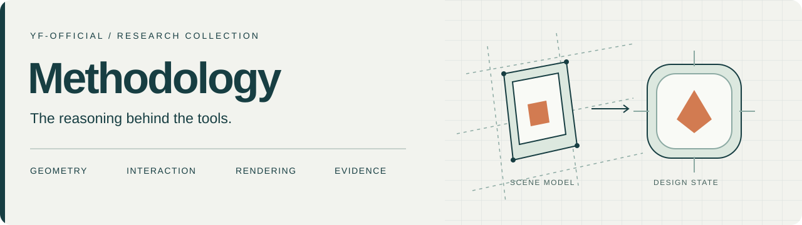

# Methodology · 方法论论文集

[English](README.md) · 简体中文

收录 yf-official 各项目的方法论论文、技术稿件与研究笔记。各篇分别介绍研究问题、方法、出版信息与阅读资料，并在可用时提供对应项目的源码链接。

[论文目录](#论文目录) · [BibTeX 引用](references.bib) · [参与完善](CONTRIBUTING.zh-CN.md)

## 论文目录

| 论文 | 核心问题 | 研究主题 | 阅读入口 |
| --- | --- | --- | --- |
| **[DeckStage](#deckstage)** | 如何遵循参考图的几何关系，同时保留原始扑克牌设计？ | 射影几何 · 非破坏性渲染 · 折叠包装 | [中文导读](papers/deckstage/README.zh-CN.md) · [英文 PDF](https://github.com/yf-official/yf-official-methodology/releases/download/paper-2026-10-01/DeckStage_Methodology.pdf) |
| **[IconLab](#iconlab)** | 如何让交互编辑与不同尺寸的导出共享一致的几何含义？ | 仿射变换 · 撤销事务 · 超采样 | [中文导读](papers/iconlab/README.zh-CN.md) · [英文 PDF](https://github.com/yf-official/yf-official-methodology/releases/download/iconlab-paper-2026-10-01/IconLab-methodology.pdf) |
| **[SHIYUN](#shiyun)** | 如何让长期运行的诗词界面协调呈现、个人诗库与有界资源？ | 状态契约 · 本地持久化 · 检索 · 内存与能耗 | [中文导读](papers/shiyun/README.zh-CN.md) · [英文 PDF](https://github.com/yf-official/yf-official-methodology/releases/download/shiyun-paper-2026-10-03/ShiYun-methodology.pdf) |
| **[VidAudio](#vidaudio)** | 如何让原生媒体工具的时长、收尾、权限和任务结果能够分别核验？ | 设计契约 · 时间完整性 · VBR 元数据 · 受限资源访问 | [中文导读](papers/vidaudio/README.zh-CN.md) · [英文 PDF](https://github.com/yf-official/yf-official-methodology/releases/download/vidaudio-paper-2026-10-03/VidAudio-methodology.pdf) |
| **[SlideSafe](#slidesafe)** | 如何解除演示文稿文字对字体环境的依赖，同时保持原视口并保留周围对象？ | OOXML 样式解析 · 固定视口渲染 · 几何不变性 · 安全替换 | [中文导读](papers/slidesafe/README.zh-CN.md) · [英文 PDF](https://github.com/yf-official/yf-official-methodology/releases/download/slidesafe-paper-2026-10-03/SlideSafe-methodology.pdf) |

### DeckStage

**Reference-Constrained Reconstruction of Playing-Card Mockup Scenes: Geometry, Non-Destructive Rendering, and Validation**<br>
参考约束下的扑克牌展示场景重建：几何、非破坏性渲染与验证（中文译名）<br>
Fox Studio · 22 页 · 英文 · 供设计评审的技术稿

扑克牌场景同时涉及实体尺寸、参考透视、物体遮挡和原始图稿。论文从线族重建出发，连接共享平面单应变换、渲染时裁切、局部圆角蒙版、倾斜扇形牌组和牌盒相机模型，再以不可变图稿图集与折叠图描述包装展开与闭合。

**可借鉴的方法：** 先建立场景模型，再处理外观；保留原始素材；让投影、可见性、拖放命中和导出遵循同一套几何关系。

**证据范围：** 给出了尺寸规格的精确检查和受控的射影／仿射合成实验。参考图的独立配准、应用性能和拟议的渲染验收条件仍需进一步验证。

[展开中文导读 →](papers/deckstage/README.zh-CN.md) · [查看发布版本](https://github.com/yf-official/yf-official-methodology/releases/tag/paper-2026-10-01)

### IconLab

**A Geometry-Consistent Method for Interactive Icon Composition and Multiresolution Export**<br>
交互式图标合成与多分辨率导出的几何一致性方法（中文译名）<br>
yf-official · 8 页 · 英文 · 技术论文

图标编辑器需要把连续手势连接到离散像素输出。论文区分规范设计状态、显示偏好、即时预览、撤销事务和快照导出，形式化描述坐标反射、仿射变换、渐变与采样，并指出原生实现基线中尚未解决的差异。

**可借鉴的方法：** 让预览与导出共享几何语义；编辑时即时反馈；以有意义的操作提交撤销记录；从同一份冻结状态分别渲染各个目标尺寸。

**证据范围：** 给出了合成覆盖率实验和 30,000 次坐标检查，尚未测量原生渲染器的逐像素一致性、交互延迟或审美收益。

[展开中文导读 →](papers/iconlab/README.zh-CN.md) · [项目源码](https://github.com/yf-official/IconLab) · [查看发布版本](https://github.com/yf-official/yf-official-methodology/releases/tag/iconlab-paper-2026-10-01)

### SHIYUN

**Resource-Aware Development of Ambient Literary Interfaces: A Contract-Based Methodology**<br>
面向环境式文学界面的资源感知开发：基于契约的方法论（中文译名）<br>
yf-official · 11 页 · 英文 · 开发阶段技术方法论稿件

原生诗词应用需要连接可中断的呈现、正确的键盘作用范围、个人诗库、本地创作与视觉自定义，同时避免积累不必要的工作。论文把需求逐项连接到责任组件、形式化契约、反例和验收观察，讨论代际保护的切换、有界选诗历史、导入等价性、预处理检索、共享字体样式及长期运行的内存治理。

**可借鉴的方法：** 区分内容规模导致的内存增长与运行时间导致的保留；为任务和缓存明确生命周期与预算；通过受控工作负载验证资源性质，而不是由界面外观推断性能。

**证据范围：** 四组选诗模型各运行 50,000 次，另有 2,000 条合成导入样本与 16 种命令上下文检查。尚未报告原生功耗测量、长时间内存测试结果或用户研究。配图为原创抽象示意图，不展示产品成品界面。

[展开中文导读 →](papers/shiyun/README.zh-CN.md) · [项目源码](https://github.com/yf-official/SHIYUN) · [查看发布版本](https://github.com/yf-official/yf-official-methodology/releases/tag/shiyun-paper-2026-10-03)

### VidAudio

**A Contract-Guided Development Methodology for Private Native Media-Extraction Tools**<br>
面向私密原生媒体提取工具的契约引导开发方法论（中文译名）<br>
yf-official · 7 页 · 英文 · 开发阶段技术方法论稿件

原生媒体工具需要协调解码、编码、文件访问、可见状态与分发产物。论文把这些边界转化为六项开发契约和分阶段验证流程，区分容器范围、解码样本数、编码帧与播放器报告时长，再把 VBR 元数据收尾、顺序任务、缓冲区需求和受限文件权限连接到明确的验收观察。

**可借鉴的方法：** 比较时长前先声明时间线策略；区分输出收尾与安全发布、任务终结进度与成功提取；验证完整结果，而不是只依赖某个组件的成功返回。

**证据范围：** 源码观察、已有七项回归测试的断言范围，以及时长与资源需求的分析计算。独立解码器覆盖、间隙重建、原子发布、重启后的权限恢复和原生性能仍属于待验收事项，不是已报告的基准结果。配图为原创抽象示意图与分析曲线，不展示产品成品界面。

[展开中文导读 →](papers/vidaudio/README.zh-CN.md) · [项目源码](https://github.com/yf-official/VidAudio) · [查看发布版本](https://github.com/yf-official/yf-official-methodology/releases/tag/vidaudio-paper-2026-10-03)

### SlideSafe

**Geometry-Invariant Vector-Backed Image Replacement for Portable Presentation Typography**<br>
面向可移植演示文稿排版的几何不变矢量图像替换方法（中文译名）<br>
yf-official · 5 页 · 英文 · 开发阶段技术方法论稿件

演示文稿即使结构有效，文字也可能随字体和渲染环境改变。论文结合分层 OOXML 样式解析、精确字体资格检查、固定视口字形渲染、显式突出显示与文字装饰，以及文本框、图形、组合和表格的分类替换策略。结果是带栅格后备图的矢量支持图片，不是可编辑的轮廓文字。

**可借鉴的方法：** 区分对象几何与字形墨迹边界；保留透明边距和段落结构；先渲染并验证完整替代对象，最后才清除原文字。

**证据范围：** 四对象基线与 32 对象合成排版测试集。压力测试中的 30 个符合条件的对象全部转换，两个有意不支持的对象保留，30 个替代对象的 XML 变换比较得到零差异。尚未测量跨引擎逐像素一致性、大规模覆盖或性能。配图为原创抽象示意图，不展示产品成品界面。

[展开中文导读 →](papers/slidesafe/README.zh-CN.md) · [项目源码](https://github.com/yf-official/SlideSafe) · [查看发布版本](https://github.com/yf-official/yf-official-methodology/releases/tag/slidesafe-paper-2026-10-03)

## 阅读、引用与复用

- **阅读：** 导读用于定位问题；公式、图表与完整论证以对应版本的 PDF 为准。
- **引用：** 使用单篇论文的作者、完整标题、年份和发布链接，可直接复制 [references.bib](references.bib)。本仓库没有为论文指定 DOI 或发表期刊／会议。
- **复用：** 按单篇论文确认权利。DeckStage 明确保留所有权利，转载需许可；IconLab、SHIYUN、VidAudio 和 SlideSafe 发布页没有声明论文复用许可。公开可读不等于获得复用授权。
- **扩充：** 按[贡献指南](CONTRIBUTING.zh-CN.md)和[论文导读模板](templates/paper-notes.md)新增条目，元数据统一记录在 [catalog.json](catalog.json)。

## 仓库结构

```text
papers/          双语论文导读、章节地图与证据边界
assets/          仓库视觉素材
templates/       新论文的导读模板
catalog.json     结构化出版信息
references.bib   单篇论文的引用条目
scripts/         目录与本地链接检查
```

PDF 保留在带版本的 GitHub Releases 中。导读独立维护，不替代或修改已发布的论文原稿。

## 后续完善方向

- 新项目有可供评审的论文后，再按同样的双语导读与元数据结构收录。
- 作者公开复现脚本和数据后，补充对应链接；当前仓库提供论文与导读。
- 修订稿使用新的发布版本，并记录论证与实验的变化。

发现失效链接、事实错误或需要补充的说明，可以[提交 Issue](https://github.com/yf-official/yf-official-methodology/issues/new/choose)，注明论文、章节及建议修改内容。
